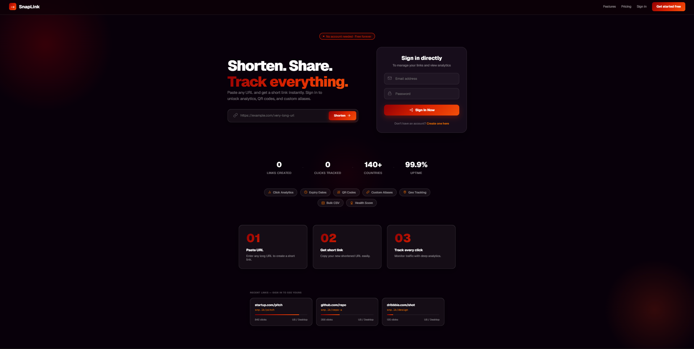
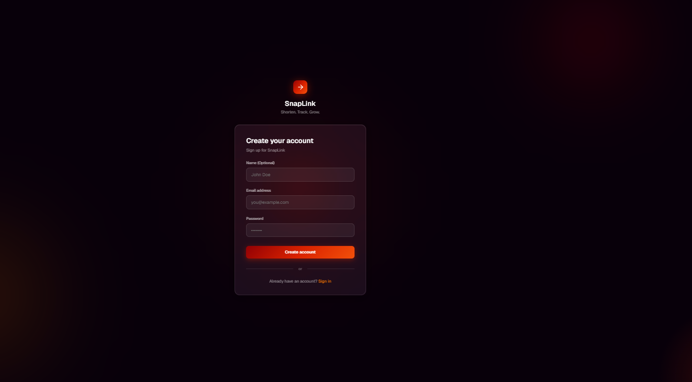
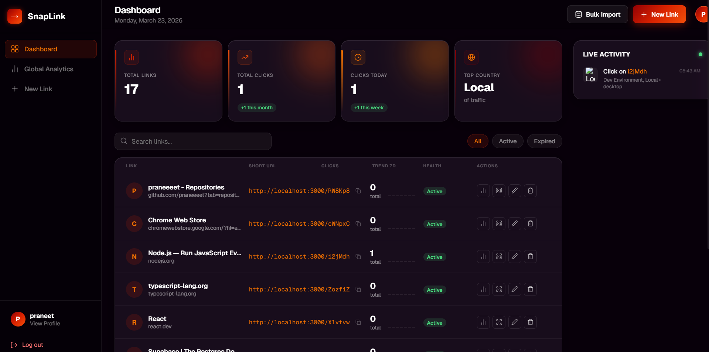
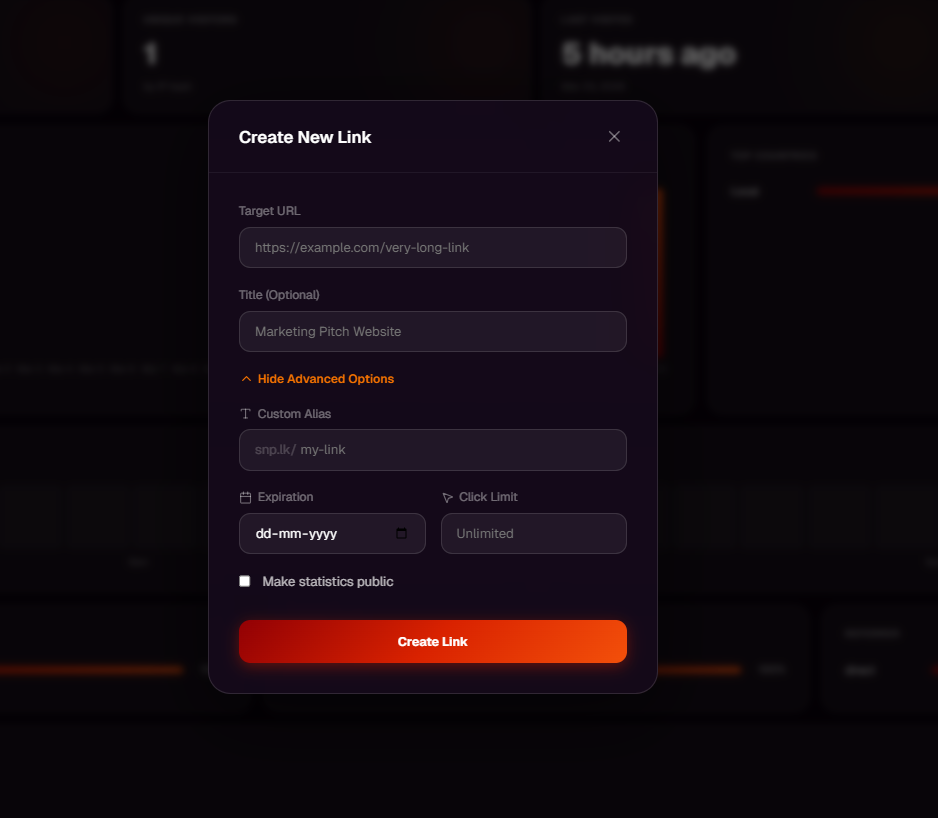
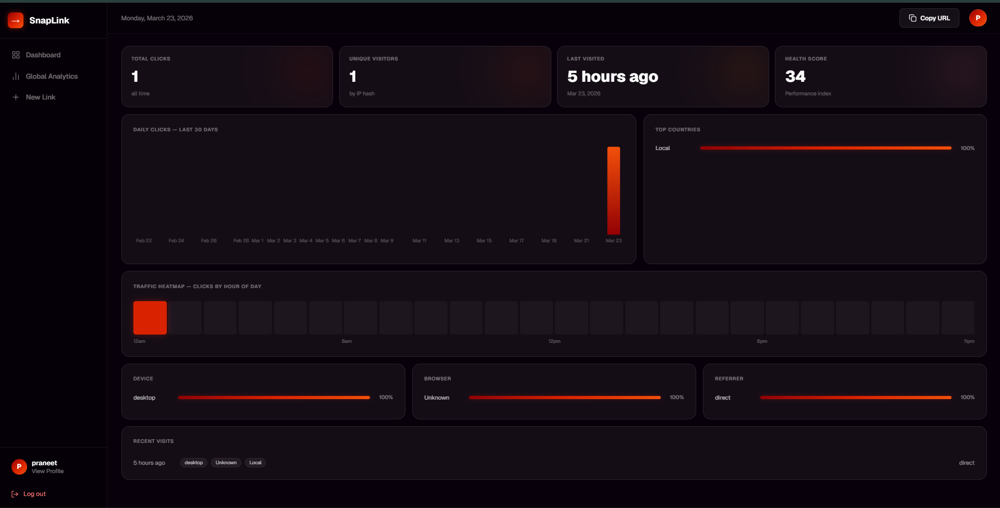
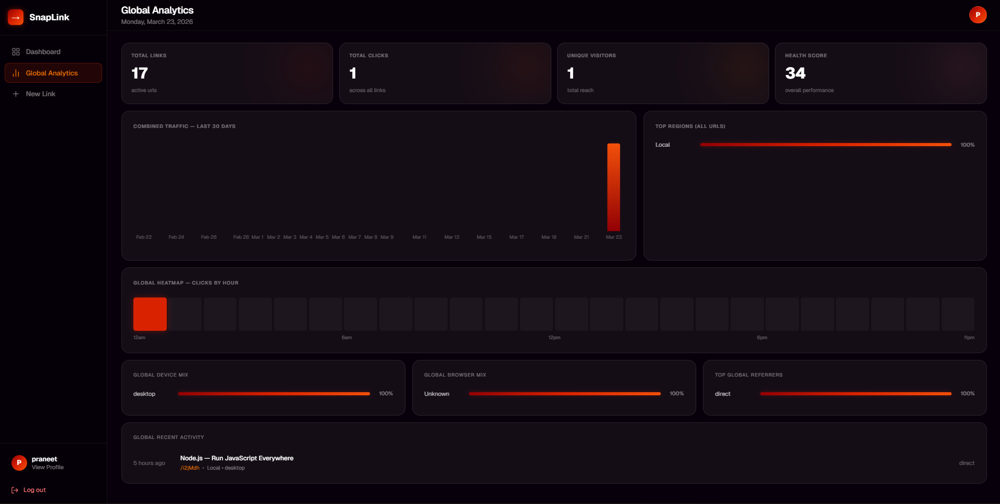
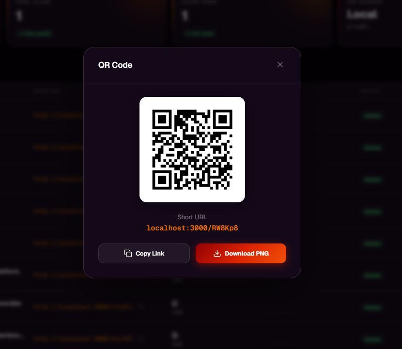
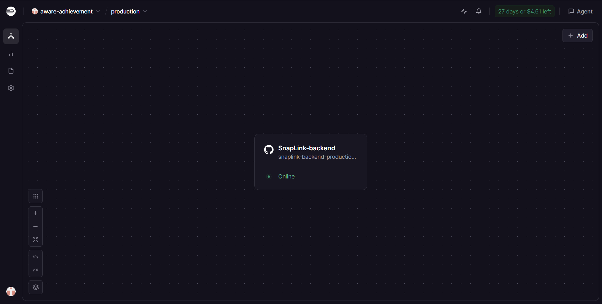
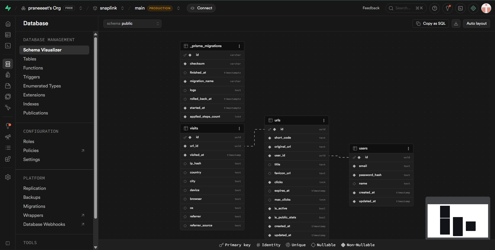
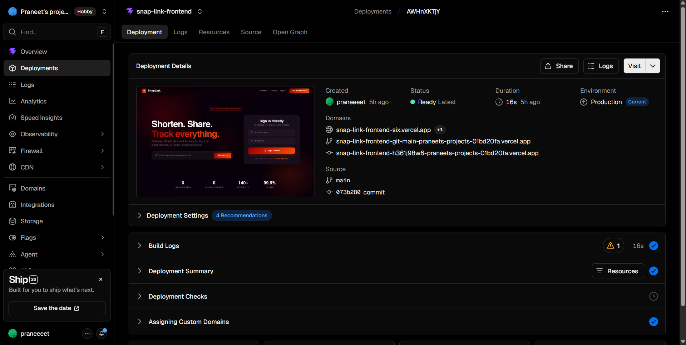

# SnapLink — URL Shortener with Analytics

> A full-stack URL shortener with real-time analytics, health scoring, peak-hour heatmaps, sparklines, and QR codes. Built for the Katomaran Full Stack Hackathon 2026.

---

## 🎥 Demo Video

**[▶ Watch on Loom](#)** ← Replace with your Loom link

> ⚠️ Submission will not be reviewed without a video.

---

## 🔗 Live Demo

| | URL |
|---|---|
| Frontend | https://snaplink-frontend.vercel.app |
| Backend API | https://snaplink-backend-production.up.railway.app |

---

## ✨ Features at a Glance

- User authentication with JWT + bcrypt
- Shorten any URL with a unique 6-char code or custom alias
- Server-side 302 redirect with async visit logging
- Full analytics — clicks, countries, devices, browsers, referrers
- **Link health score 0–100** (unique — no other URL shortener has this)
- **Peak hour heatmap** — 24-cell click distribution by hour
- **Sparklines** — 7-day trend inline on every dashboard row
- QR code generation + PNG download
- Expiry dates + max click limits
- Bulk CSV upload
- Public stats page per link

---

## 📚 Documentation

| Document | Description |
|---|---|
| [Planning & Features](docs/PLANNING.md) | AI planning process, feature list, prompts used |
| [Architecture](docs/ARCHITECTURE.md) | System design, DB schema, data flow |
| [API Reference](docs/API.md) | All endpoints with request/response examples |
| [Setup Guide](docs/SETUP.md) | Local development setup instructions |

---

## 🛠 Tech Stack

| Layer | Technology |
|---|---|
| Frontend | React 18, Vite, TypeScript |
| Backend | NestJS, TypeScript |
| Database | PostgreSQL via Prisma ORM |
| Auth | JWT + bcrypt |
| Hosting | Railway (backend) + Vercel (frontend) + Supabase (DB) |
| Charts | Recharts |
| QR Code | qrcode npm |
| Geo | geoip-lite |
| UA Parsing | ua-parser-js |

---

## ⚡ Quick Start

```bash
# Clone
git clone https://github.com/YOURUSERNAME/snaplink.git
cd snaplink

# Backend
cd snaplink-backend
npm install
cp .env.example .env        # fill in your values
npx prisma migrate dev
npm run start:dev            # runs on http://localhost:3000

# Frontend (new terminal)
cd snaplink-frontend
npm install
cp .env.example .env.local  # set VITE_API_URL=http://localhost:3000
npm run dev                  # runs on http://localhost:5173
```

See [detailed setup guide](docs/SETUP.md) for full instructions.

---

## 📸 Screenshots

## 📸 Screenshots

### Home Page


### Login


### Dashboard


### Create Link


### Analytics


### Global Analytics


### QR Code


### Railway Backend (Deployed)


### Supabase Database


### Vercel Frontend (Deployed)


---

## 💡 Assumptions

1. Users must register to create and manage links
2. Public visitors can click short links without login
3. IP addresses are SHA-256 hashed — raw IPs never stored (GDPR)
4. OG metadata (title + favicon) fetched asynchronously after link creation
5. Health score calculated fresh on every analytics fetch, not stored
6. Bulk CSV expects a single `url` column header
7. Expired links return 410 Gone (not 404)
8. Public stats page is opt-in per link, off by default

---

*This project is a part of a hackathon run by https://katomaran.com*
